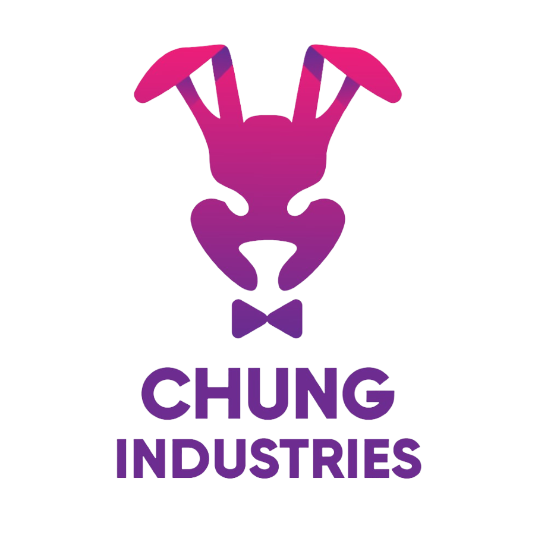

<!-- Improved compatibility of back to top link: See: https://github.com/othneildrew/Best-README-Template/pull/73 -->

<a id="readme-top"></a>

<!-- PROJECT SHIELDS -->
<!--
*** I'm using markdown "reference style" links for readability.
*** Reference links are enclosed in brackets [ ] instead of parentheses ( ).
*** See the bottom of this document for the declaration of the reference variables
*** for contributors-url, forks-url, etc. This is an optional, concise syntax you may use.
*** https://www.markdownguide.org/basic-syntax/#reference-style-links
-->

[![Contributors][contributors-shield]][contributors-url]
[![Forks][forks-shield]][forks-url]
[![Stargazers][stars-shield]][stars-url]
[![Issues][issues-shield]][issues-url]
[![MIT License][license-shield]][license-url]

<!-- PROJECT LOGO -->
<br />
<div align="center">
  <a href="https://github.com/chrille0313/ChungIndustries">
    
  </a>

<h3 align="center">ChungIndustries</h3>

  <p align="center">
    project_description
    <br />
    <a href="https://github.com/chrille0313/ChungIndustries"><strong>Explore the docs »</strong></a>
    <br />
    <br />
    <a href="https://github.com/chrille0313/ChungIndustries">View Demo</a>
    ·
    <a href="https://github.com/chrille0313/ChungIndustries/issues/new?labels=bug&template=bug-report---.md">Report Bug</a>
    ·
    <a href="https://github.com/chrille0313/ChungIndustries/issues/new?labels=enhancement&template=feature-request---.md">Request Feature</a>
  </p>
</div>

<!-- TABLE OF CONTENTS -->
<details>
  <summary>Table of Contents</summary>
  <ol>
    <li>
      <a href="#about-the-project">About The Project</a>
      <ul>
        <li><a href="#built-with">Built With</a></li>
      </ul>
    </li>
    <li>
      <a href="#getting-started">Getting Started</a>
      <ul>
        <li><a href="#prerequisites">Prerequisites</a></li>
        <li><a href="#installation">Installation</a></li>
      </ul>
    </li>
    <li><a href="#usage">Usage</a></li>
    <li><a href="#contributing">Contributing</a></li>
    <li><a href="#license">License</a></li>
    <li><a href="#contact">Contact</a></li>
    <li><a href="#acknowledgments">Acknowledgments</a></li>
  </ol>
</details>

<!-- ABOUT THE PROJECT -->

## About The Project

<p align="right">(<a href="#readme-top">back to top</a>)</p>

<!-- GETTING STARTED -->

## Getting Started

Insert introduction

### Prerequisites

Insert instructions

- npm
  ```sh
  npm install npm@latest -g
  ```

### Installation

1. Get a free API Key at [https://example.com](https://example.com)
2. Clone the repo
   ```sh
   git clone https://github.com/chrille0313/ChungIndustries.git
   ```
3. Install NPM packages
   ```sh
   npm install
   ```
4. Enter your API in `config.js`
   ```js
   const API_KEY = 'ENTER YOUR API';
   ```
5. Change git remote url to avoid accidental pushes to base project
   ```sh
   git remote set-url origin chrille0313/ChungIndustries
   git remote -v # confirm the changes
   ```

<p align="right">(<a href="#readme-top">back to top</a>)</p>

<!-- USAGE EXAMPLES -->

## Usage

Use this space to show useful examples of how a project can be used. Additional screenshots, code examples and demos work well in this space. You may also link to more resources.

_For more examples, please refer to the [Documentation](https://example.com)_

<p align="right">(<a href="#readme-top">back to top</a>)</p>

<!-- CONTRIBUTING -->

## Contributing

Contributions are what make the open source community such an amazing place to learn, inspire, and create. Any contributions you make are **greatly appreciated**.

If you have a suggestion that would make this better, please fork the repo and create a pull request. You can also simply open an issue with the tag "enhancement".
Don't forget to give the project a star! Thanks again!

<p align="right">(<a href="#readme-top">back to top</a>)</p>

### Top contributors:

<a href="https://github.com/chrille0313/ChungIndustries/graphs/contributors">
  
</a>

<!-- LICENSE -->

## License

Distributed under the MIT License. See `LICENSE.txt` for more information.

<p align="right">(<a href="#readme-top">back to top</a>)</p>

<!-- CONTACT -->

## Contact

Christian Mattsson - [@chrille0313](https://discordapp.com/users/283637328822534144) - chrille_0313@hotmail.com

Mårten Granath - [@AuthenticMailbox](https://discordapp.com/users/244518661199495168) - webdant2@gmail.com

Project Link: [https://github.com/chrille0313/ChungIndustries](https://github.com/chrille0313/ChungIndustries)

<p align="right">(<a href="#readme-top">back to top</a>)</p>

<!-- MARKDOWN LINKS & IMAGES -->
<!-- https://www.markdownguide.org/basic-syntax/#reference-style-links -->

[contributors-shield]: https://img.shields.io/github/contributors/chrille0313/ChungIndustries.svg?style=for-the-badge
[contributors-url]: https://github.com/chrille0313/ChungIndustries/graphs/contributors
[forks-shield]: https://img.shields.io/github/forks/chrille0313/ChungIndustries.svg?style=for-the-badge
[forks-url]: https://github.com/chrille0313/ChungIndustries/network/members
[forks-shield]: https://img.shields.io/github/forks/chrille0313/ChungIndustries.svg?style=for-the-badge
[forks-url]: https://github.com/chrille0313/ChungIndustries/network/members
[stars-shield]: https://img.shields.io/github/stars/chrille0313/ChungIndustries.svg?style=for-the-badge
[stars-url]: https://github.com/chrille0313/ChungIndustries/stargazers
[issues-shield]: https://img.shields.io/github/issues/chrille0313/ChungIndustries.svg?style=for-the-badge
[issues-url]: https://github.com/chrille0313/ChungIndustries/issues
[license-shield]: https://img.shields.io/github/license/chrille0313/ChungIndustries.svg?style=for-the-badge
[license-url]: https://github.com/chrille0313/ChungIndustries/blob/master/LICENSE.txt
[product-screenshot]: images/screenshot.png
